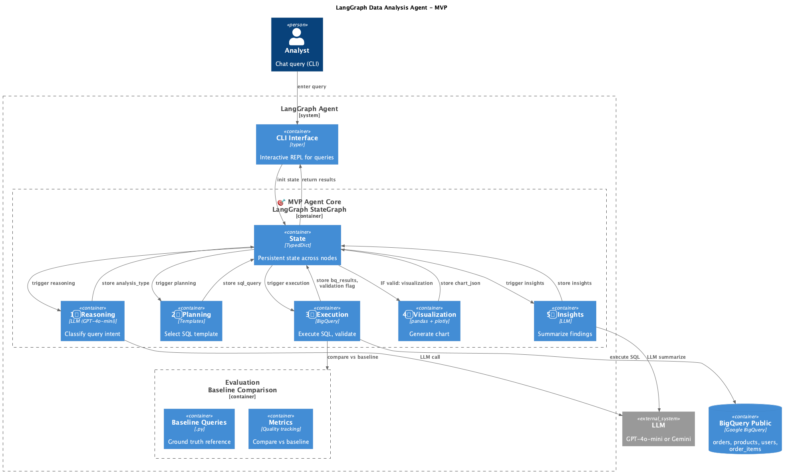
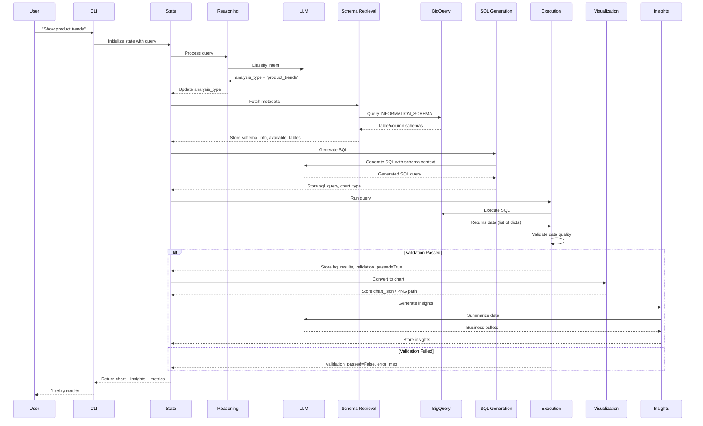
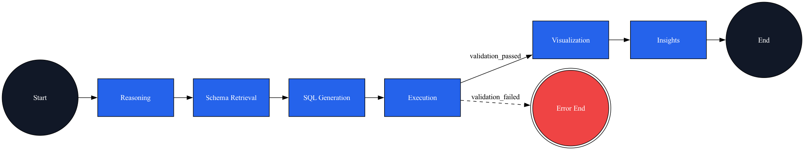

## LangGraph Data Analysis Agent. Solution & MVP

This repository contains the architecture notes **and** the final MVP implementation summary for a LangGraph-powered analytics assistant. The original system context (C4 + Mermaid) remains below, followed by a concise recap of the MVP behaviour (that in [./src](./src)), quickstart instructions, and roadmap items (aka TODOs).

Demo link: https://youtu.be/kAk0Aik8dRg

<!-- START doctoc generated TOC please keep comment here to allow auto update -->
<!-- DON'T EDIT THIS SECTION, INSTEAD RE-RUN doctoc TO UPDATE -->
**Table of Contents**

- [Architecture Overview](#architecture-overview)
  - [System Architecture (C4, Container Level)](#system-architecture-c4-container-level)
  - [Execution Flow (Mermaid Sequence Diagram)](#execution-flow-mermaid-sequence-diagram)
- [Component Summary](#component-summary)
- [Evaluation Philosophy (reasoning for evaluation container, out of MVP)](#evaluation-philosophy-reasoning-for-evaluation-container-out-of-mvp)
- [MVP Summary](#mvp-summary)
  - [LangGraph Agent Flow](#langgraph-agent-flow)
  - [Quickstart](#quickstart)
    - [Makefile](#makefile)
    - [Manually](#manually)
  - [Example Prompts](#example-prompts)
  - [Tooling](#tooling)
  - [TODO / Roadmap](#todo--roadmap)

<!-- END doctoc generated TOC please keep comment here to allow auto update -->

## Architecture Overview

The following system design to process e-commerce data from Google BigQuery and generates actionable business insights. The agent uses a linear reasoning-to-execution flow with 6 core nodes (Reasoning, Schema Retrieval, SQL Generation, Execution, Visualization, Insights) orchestrated through LangGraph's state machine. The system now uses AI-driven SQL generation with schema-aware context instead of hardcoded templates.

### System Architecture (C4, Container Level)



- Sources: [`solution-arch.puml`](./docs/solution-arch.puml)

### Execution Flow (Mermaid Sequence Diagram)



## Component Summary
- **Reasoning** – classifies the intent using Gemini/OpenAI and records the rationale so downstream nodes can explain the plan.
- **Schema Retrieval** – fetches database metadata (tables, columns, types) from BigQuery INFORMATION_SCHEMA based on the analysis type, providing schema context to prevent SQL hallucination.
- **SQL Generation** – uses LLM (gemini-1.5-pro) with schema context to dynamically generate BigQuery SQL queries tailored to the user's intent, replacing hardcoded templates with flexible AI-driven generation.
- **Execution** – runs BigQuery with guardrails (byte caps, dataset-level joins), stores rows/columns, and computes validation metrics.
- **Visualization** – renders the result to Plotly JSON and saves a PNG snapshot to `data-plotly/` for quick review.
- **Insights** – samples the first rows and asks the LLM for concise, actionable bullets tailored to the detected intent.

## Source Layout
```
src/
  __init__.py
  main.py               # So, the entrypoint
  graph.py              # LangGraph assembly and state transitions
  config.py / constants.py
  cli.py                # Typer CLI entrypoint (dataset prompts, chart links)
  baselines.py / metrics.py
  models/
    state.py            # Shared AgentState TypedDict (to be upgraded later)
    sql_generation_types.py  # TypedDicts for SQL generation tracking
  nodes/
    __init__.py
    prompts.py          # Centralised LLM prompt strings with some todo on better versioning ofc
    reasoning.py        # Intent classification
    schema_retrieval.py # Fetch database metadata from INFORMATION_SCHEMA
    sql_generation.py   # LLM generates SQL with schema context
    execution.py        # BigQuery runner + validation
    visualization.py    # Plotly JSON + PNG generation
    insights.py         # LLM summarisation
  services/
    bigquery_runner.py  # Thin BigQuery wrapper w/ limits
    llm_client.py       # Gemini/OpenAI factory with fallback logic

tests/
  test_*.py             # Node-level smoke tests and graph compilation checks
docs/                   # Docs, docs
  agent_flow.png        # Generated LangGraph diagram (`make diagram`)
  ...
```

## Evaluation Philosophy (reasoning for evaluation container, out of MVP)

Every change to the LangGraph agent should be backed by evaluation:

- **Backtesting & regression** – use hard-coded prompts/responses to ensure behaviour stays above the templated baseline.
- **Against the "all-to-LLM" baseline** – the curated pipeline should outperform a naive "ask the LLM with everything supplied, or e.g. sonar-reasoning-pro API of Pplx used" approach on accuracy, determinism, and cost, timing
- **Production judgment** – monitor live responses (e.g., via Langfuse or similar) to verify that new prompts and templates deliver better insights before shipping broadly (e.g. mb with even LLM jugjemnt metrics)

## MVP Summary

For the MVP only core components of digram above kept, insights:

- **Dataset**: `bigquery-public-data.thelook_ecommerce`
- **Flow**: Reasoning → Schema Retrieval → SQL Generation → Execution → Visualization → Insights implemented via LangGraph state machine.
- **SQL Generation**: AI-driven dynamic SQL generation using LLM (gemini-1.5-pro) with schema-aware context injection, replacing hardcoded templates for unlimited query flexibility.
- **Outputs**: Plotly JSON + auto-saved PNG under `data-plotly/`, metrics (`latency_sec`, `rows_returned`, `data_completeness`, `schema_retrieval_time_ms`, `sql_generation_time_ms`), human-readable insights.
- **LLM strategy**: Gemini default with automatic OpenAI fallback; prompts centralised in `src/nodes/prompts.py` for future versioning. SQL generation uses gemini-1.5-pro for higher quality.

### LangGraph Agent Flow



ref: regenerate with `make diagram` — requires Graphviz `dot`

### Quickstart

> It is supposed that you have already `my-service-account.json` - aka JSON with BigQuery User Role for Service User account, so the one from https://console.cloud.google.com/

> Also pay attention, that `.env` file with setledup envs according to [env.example](env.example) should be presentated in the root. There are GOOGLE_CLOUD_PROJECT_ID from your `my-service-account.json` and LLM tokens: for Google (Gemini) and OpenAI, or the one only.

> I do not use wasm/docker and other type of isolation coz it is a MVP and test task assignment. For production prob it is better to prepare wheel/package and so on, thus - simple venv isolation flow demostrated below, with some **makefile** script commands

Tip: `make install` will create the virtualenv, upgrade pip, and install dependencies for you (all subsequent targets reuse `venv/`), but installed **python3.11+ is strick requirement**.

#### Makefile

It is recommended flow

1. `make install`
2. `make run` 

> `make test` / `make lint` / `make diagram` as needed, 

#### Manually

```bash
python3 -m venv venv
source venv/bin/activate
pip install -r requirements.txt

mkdir -p .secrets
mv ~/Downloads/my-service-account.json .secrets/bigquery-sa.json
export GOOGLE_APPLICATION_CREDENTIALS="$(pwd)/.secrets/bigquery-sa.json"
# optional: export OPENAI_API_KEY=... / GOOGLE_API_KEY=...

python -m src.cli    # or: make run
```
The CLI greets you with the dataset link and sample prompts, and prints clickable links to the generated PNG charts.


### Example Prompts
| Analysis Type             | Prompt                                                    | Output Highlights                                         |
|---------------------------|-----------------------------------------------------------|-----------------------------------------------------------|
| Product trends            | `Show product revenue trends for the last year`           | Monthly revenue + SKU trend, insights on growth           |
| Customer segmentation     | `Segment customers by country for the past 12 months`     | Top-country bar chart, revenue mix commentary             |
| Geographic sales analysis | `Where are we seeing the strongest regional sales growth?`| Country/state bar chart, regional performance insights    |

### Tooling
- `make run` – launches the CLI with a credential sanity-check.
- `make diagram` – regenerates `docs/agent_flow.png` (requires Graphviz system package + Python `graphviz`).
- `python -m pytest` – smoke tests for nodes and graph assembly.
- `ruff check src tests` – lint suggestions.

### TODO / Roadmap
- ✅ **Phase 1 Complete**: AI-driven SQL generation with schema-aware context (replaces hardcoded templates)
- **Phase 2**: Add SQL validation (dry-run) and retry logic with error correction
- **Phase 3**: Add feature flags for gradual rollout and enhanced error handling
- error/rate limiting fallback logic (that actually depends on functional and **non functional requirement** that should be discussed and evaluated [and that has not done to optimise timing for the task/proeject])
- fune-tuning not covered at all, but should be a result of experiemnt/mentrics and if we have resources for that
- Replace the `TypedDict`/dict state with dataclasses or pydantic models for stricter typing/validation.
- Add structured retry/backoff and explicit rate-limit handling (LLMs + BigQuery jobs).
- Introduce prompt/version telemetry (e.g., Langfuse) so prompt changes are tracked and searchable.
- Build an evaluation harness that replay prompts, compare against the templated baseline, and capture human/LLM judgements before shipping changes.
- Package for deployment (Dockerfile, CI, cloud runner) and explore WASM/hosted UI options for broader access.
- Expand the SQL template library with parameterisation, caching, and richer baseline comparisons.
